# AttendAI — Face Recognition Attendance System

> An AI-powered classroom attendance system using ESP32-CAM, AWS EC2, InsightFace, and DynamoDB. Detects student faces in real-time, marks attendance automatically using an anti-proxy 3-window system, and sends email notifications after every session.

---

## 📸 System Overview

```
ESP32-CAM  ──(POST /upload every 500ms)──►  AWS EC2 Flask Server
                                                     │
                          ┌──────────────────────────┼──────────────────────┐
                          ▼                           ▼                     ▼
                  InsightFace Recognition      DynamoDB Storage       AWS SES Email
                  (buffalo_l model, GPU)       (4 tables)            (student notify)
                          │
                          ▼
                   Browser Dashboard
                (Teacher / Admin Portal)
```

---

## 🖥️ Screenshots

### Login Page
> Two roles — Teacher and Admin, each with a separate portal.

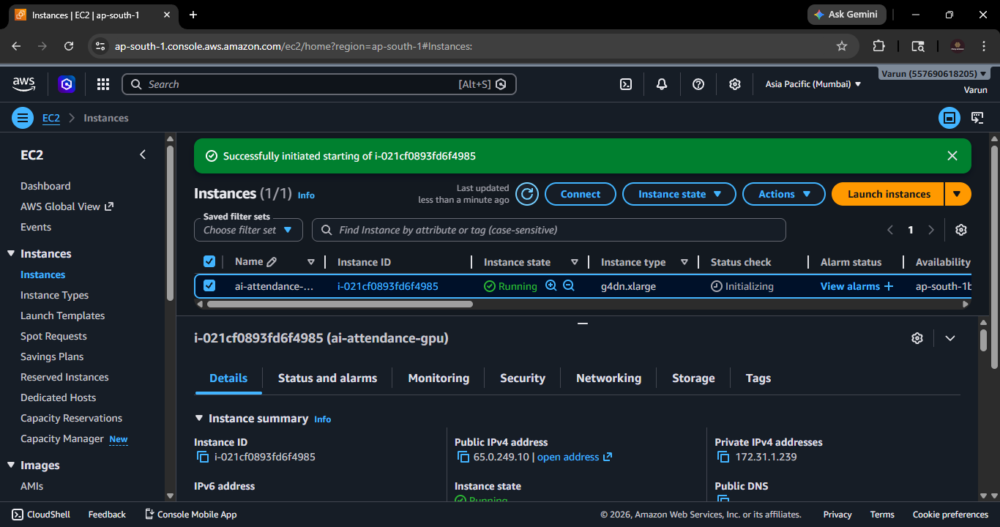

---

### EC2 Instance — Running
> AWS g4dn.xlarge with NVIDIA T4 GPU, Mumbai region (`ap-south-1`), Elastic IP `65.0.249.10`.

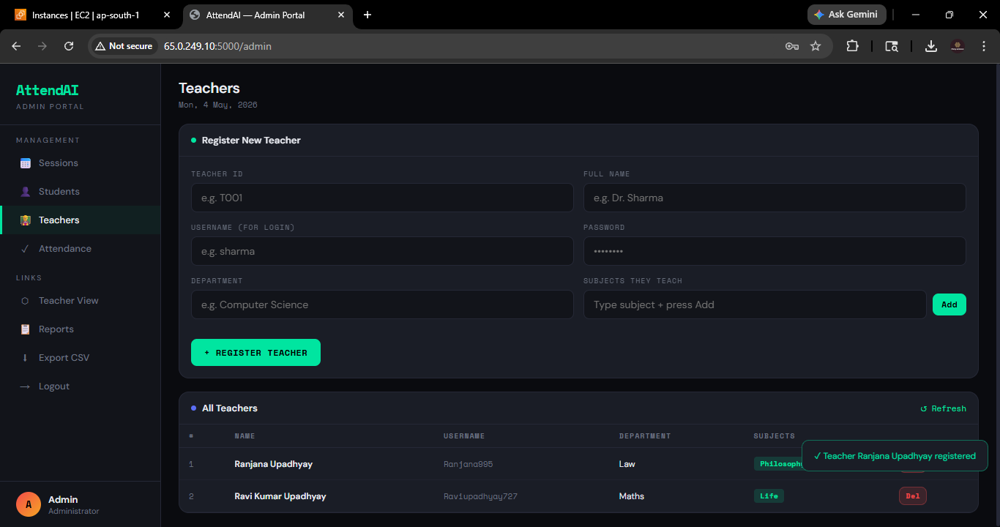

---

### Project File Structure — EC2 SSH
> Directory layout on the EC2 instance — Python files, templates folder, and engine module.

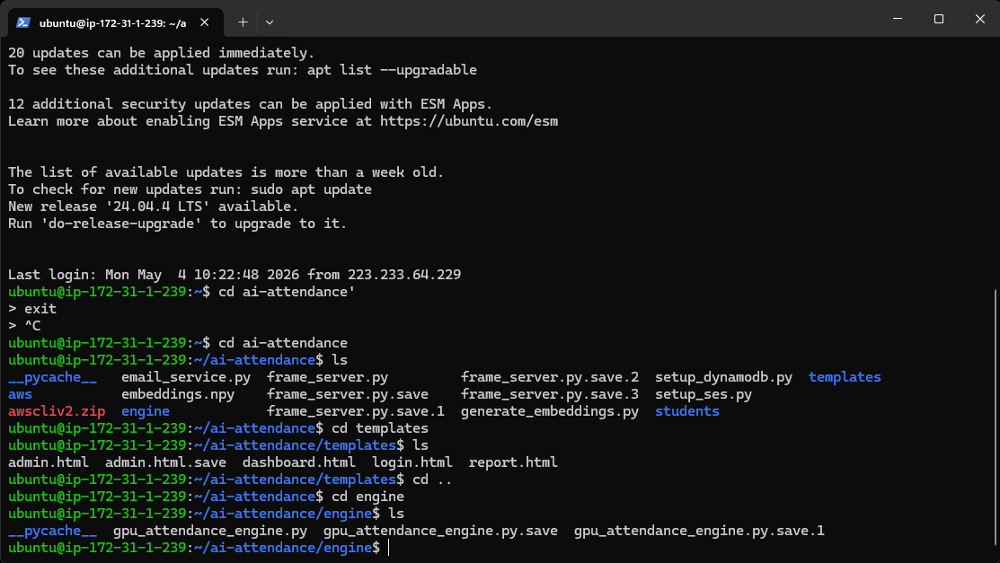

---

### Server Startup — EC2 Terminal
> Flask server starts, InsightFace loads `buffalo_l` models, 6 students loaded from DynamoDB. The CUDA warnings are non-fatal — model falls back to `CPUExecutionProvider` and recognition works correctly.

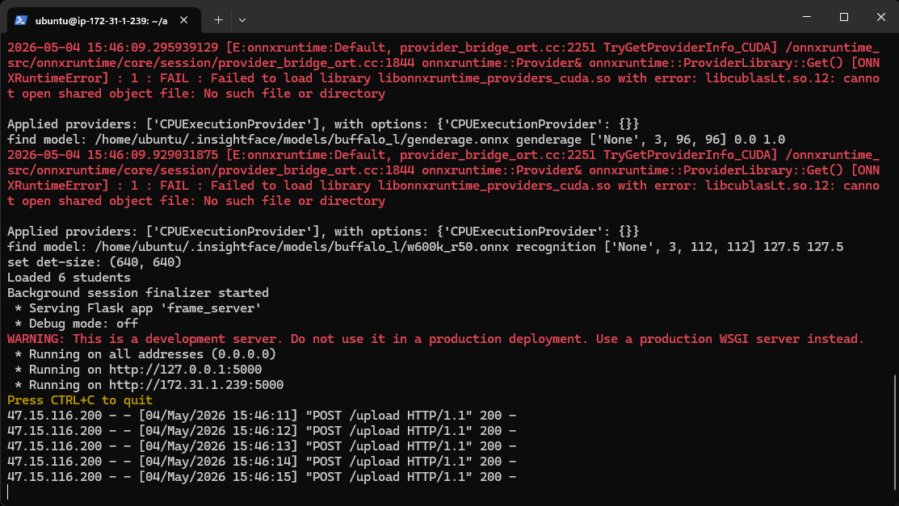

---

### Teacher Dashboard — No Active Session
> Stats cards: present today, total registered, low attendance count, and today's rate. Window tables empty when no session is running.

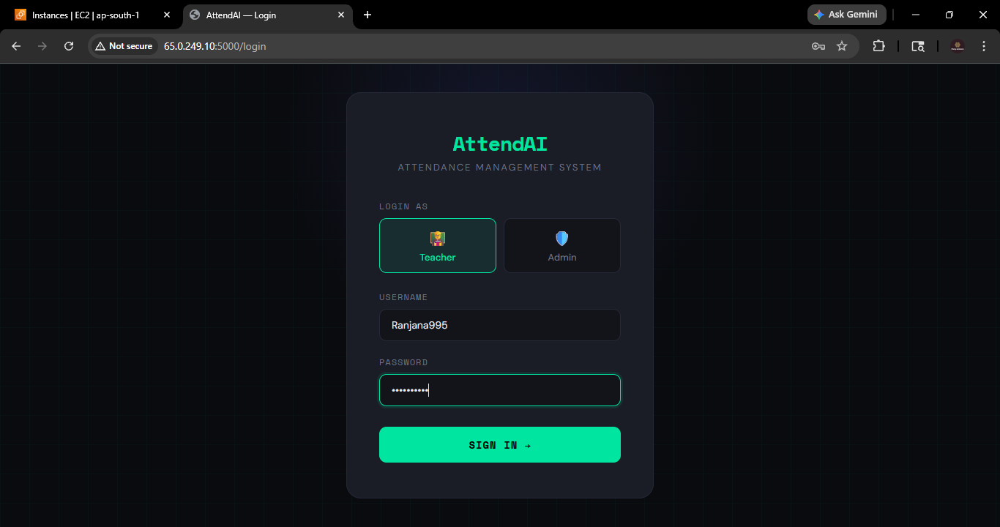

---

### Teacher Dashboard — Active Session with Real-time Detection
> Session "Philosophy" active — START window open (21:17–21:27), 2 students detected so far (Varun Upadhyay + Arnav), 27 minutes 6 seconds remaining.

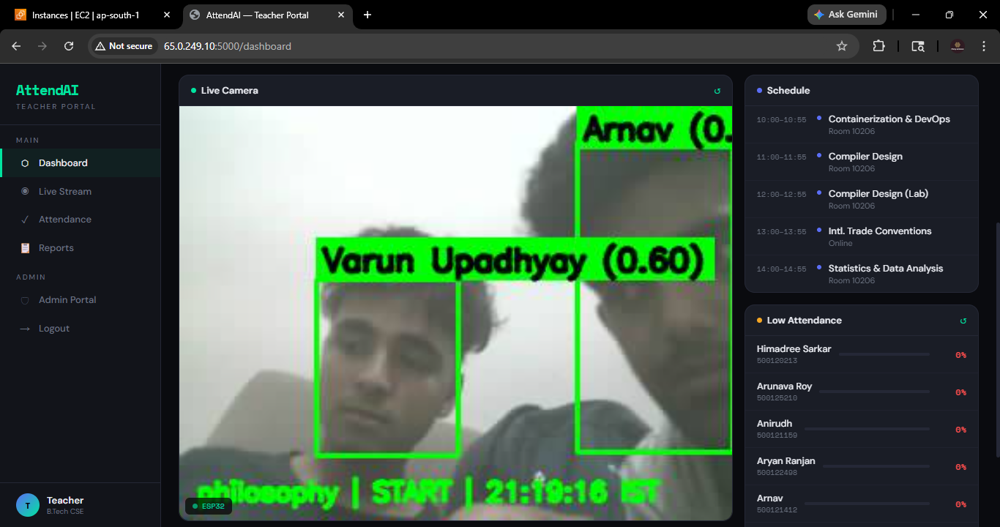

---

### Live Stream — Face Recognition (Multiple Students)
> InsightFace detecting and labelling two students simultaneously with confidence scores. Session overlay at bottom shows subject, current window, and IST time.

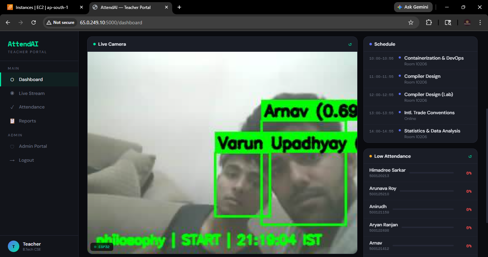

---

### Live Stream — Named Student Detected
> Bounding box with name and confidence score (0.60). Green box = known registered student.

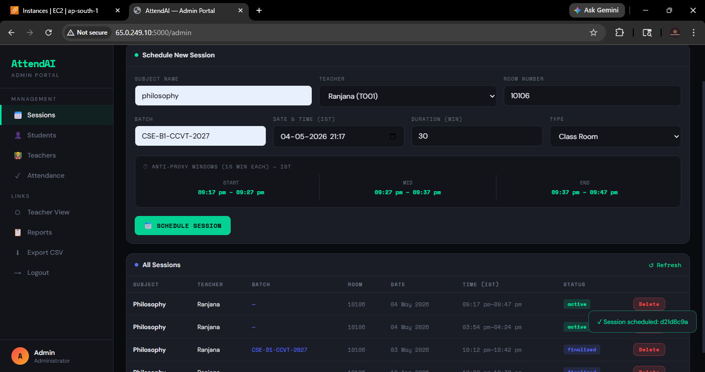

---

### Live Stream — Unknown Face
> Unregistered person detected, labelled "Unknown" with a red bounding box.

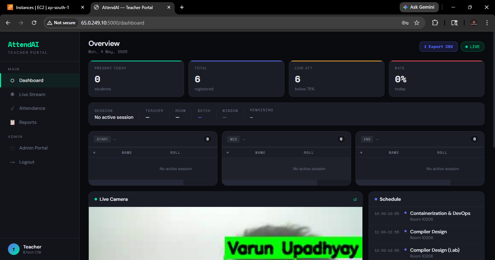

---

### Admin Portal — Student Registration with ESP32 Live Feed
> Left panel: live annotated ESP32 stream. Right panel: captured photo with "Face detected — ready to register" confirmation. Email field for attendance notifications visible above.

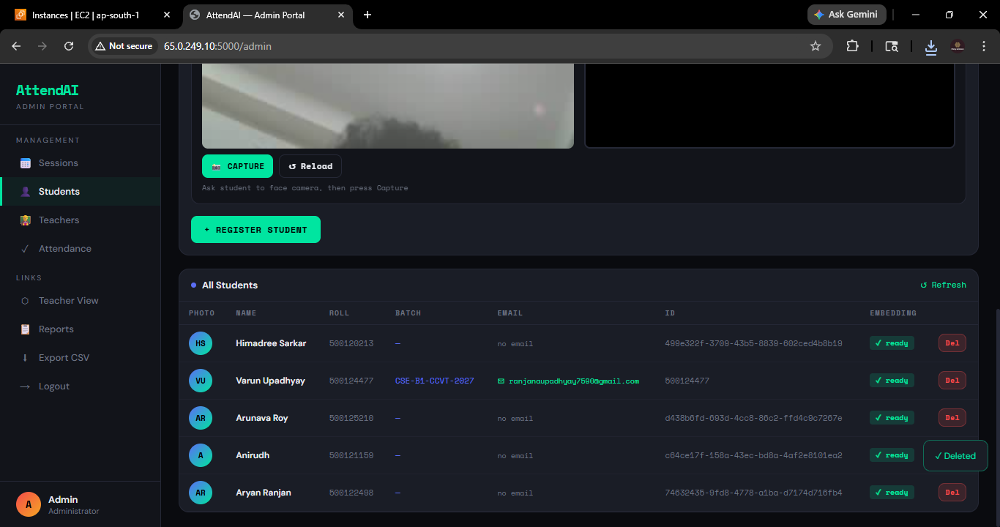

---

### Admin Portal — All Students Table
> Student list with initials avatar, roll number, batch, email, UUID, and embedding status badge (`✓ ready`).

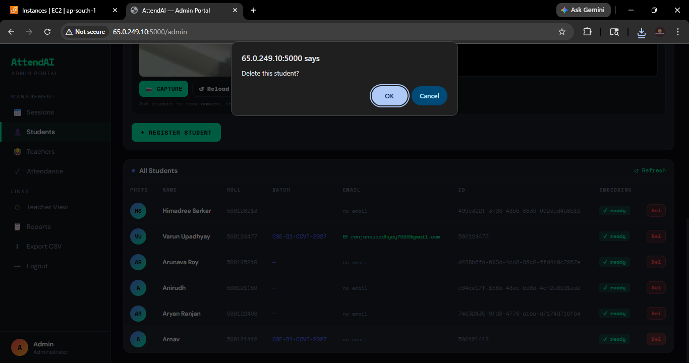

---

### Admin Portal — Delete Student
> Confirm dialog before removing a student record from DynamoDB.

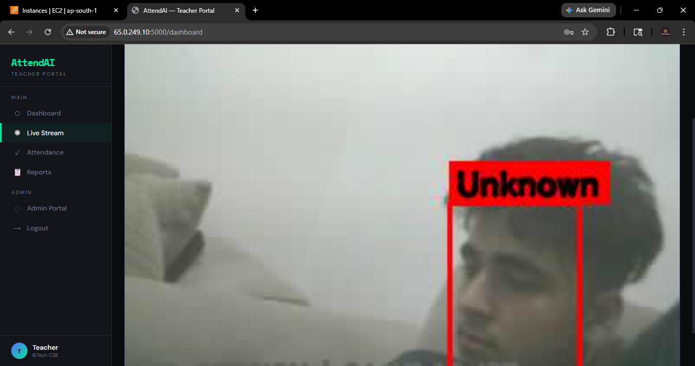

---

### Admin Portal — Schedule Session (Empty)
> Schedule form with subject, teacher dropdown, room, batch, date/time (IST), duration, type. Anti-proxy windows auto-calculated and displayed in real-time below.


---

### Admin Portal — Schedule Session (Filled with Window Preview)
> Filled: "Philosophy", Ranjana (T001), Room 10106, 30 min. Windows: START 09:17–09:27, MID 09:27–09:37, END 09:37–09:47 pm IST.

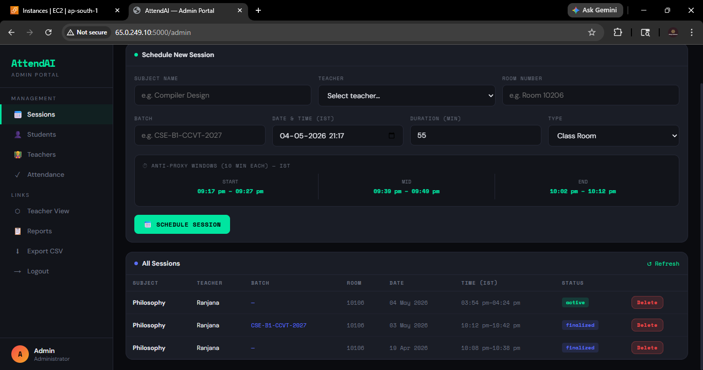

---

### Admin Portal — Session Scheduled Successfully
> Toast notification confirming new session ID. Sessions list updated with `active` status badge.


---

### Admin Portal — Sessions List with Delete
> All sessions with subject, teacher, batch, room, date, time (IST), and status (active / finalized). Delete confirmation dialog shown.

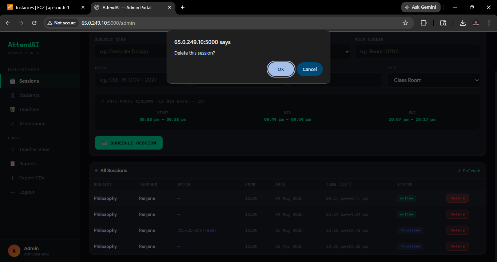

---

### Admin Portal — Teachers Management
> Register teacher form with ID, name, username/password, department, subjects. List shows registered teachers with success notification toast.

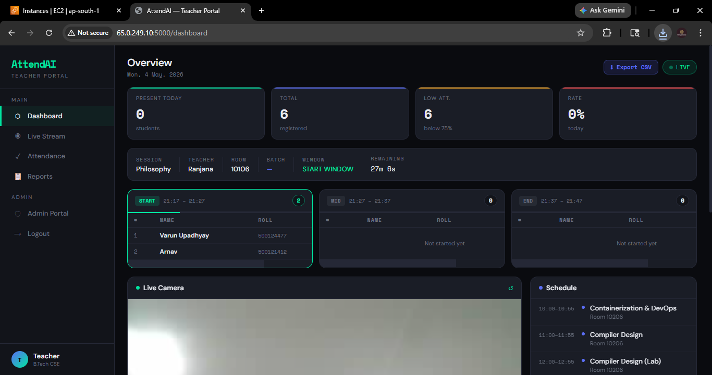

---

### CSV Export — Attendance in Excel
> Exported CSV opened in Microsoft Excel. Columns: Name, Roll No., Batch, Student ID, Date, Time (IST), Subject, Room, Teacher, Window 1, Window 2, Window 3, Windows Seen, Status.

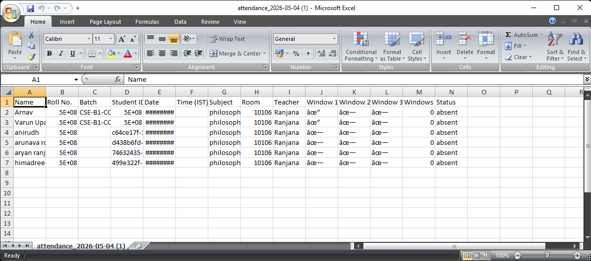

### ESP32 connections
> So for an IoT device we can use ESP32 and ftdi and here are the connections , i have also used a capacitor to make the power constant and before writting code to esp make sure the wifiname and password is changed according to you in the ardrino file for esp 32 the INO file 

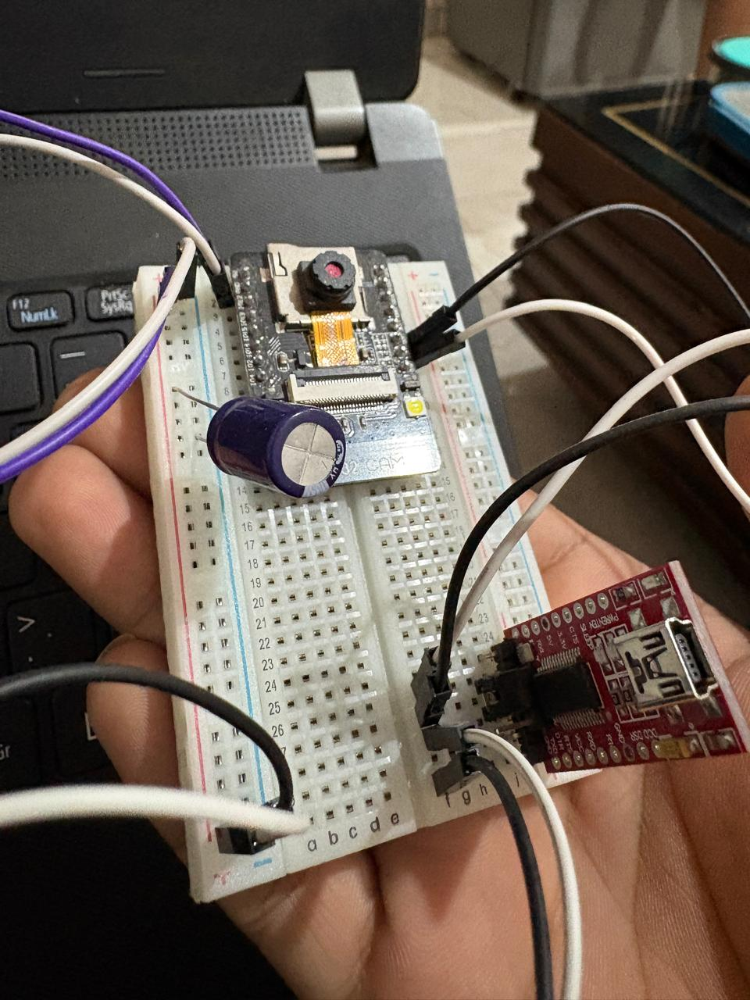

---

## ✨ Features

- **Real-time face recognition** — InsightFace `buffalo_l` model with cosine similarity matching
- **Anti-proxy attendance** — 3 detection windows (START / MID / END), present = detected in ≥ 2/3
- **ESP32-CAM live stream** — MJPEG at port 81, frames pushed to EC2 every 500ms via HTTP POST
- **Admin Portal** — register students with live ESP32 photo, manage teachers and sessions
- **Teacher Portal** — live annotated stream, real-time window detection tables, session countdown
- **Email notifications** via AWS SES after each session finalizes (present/absent + window times)
- **Background finalizer thread** — auto-finalizes sessions even if no frames arrive after end time
- **CSV export** of full attendance records
- **IST timezone** — all timestamps and session times in Indian Standard Time

---

## 🗂️ Project Structure

```
ai-attendance/                          ← Deploy this on EC2
│
├── frame_server.py                     # Main Flask server
├── email_service.py                    # AWS SES email notifications
├── generate_embeddings.py              # One-time: generate embeddings from photos
├── setup_dynamodb.py                   # One-time: create DynamoDB tables
├── setup_ses.py                        # One-time: verify SES sender email
├── embeddings.npy                      # Optional local embedding cache
│
├── engine/
│   └── gpu_attendance_engine.py        # InsightFace engine, window logic, finalization
│
├── templates/
│   ├── login.html                      # Login page
│   ├── dashboard.html                  # Teacher portal
│   ├── admin.html                      # Admin portal
│   └── report.html                     # Per-student attendance report
│
├── students/                           # Student photos (not committed to git)
│   └── <student_id>.jpg
│
└── Images/                             # Screenshots for this README
    └── 2.png ... 20.png

ESP32-CAM/                              ← Flash this to the ESP32-CAM board
├── Cameraforfaceattendence.ino         # Main sketch — WiFi, upload loop
├── app_httpd.cpp                       # MJPEG stream HTTP server
├── camera_index.h                      # Camera web index
├── camera_pins.h                       # GPIO pin definitions for all supported boards
├── board_config.h                      # Board model selection (AI_THINKER active)
└── partitions.csv                      # Custom partition table (3MB APP space required)
```

---

## 🔧 Hardware Requirements

| Component | Spec |
|-----------|------|
| **ESP32-CAM** | AI Thinker model with PSRAM |
| **Power Supply** | **5V 2A wall adapter** — laptop USB causes brownout reset loop |
| **USB Cable** | Short, thick cable — long/thin cables drop voltage under WiFi load |
| **AWS EC2** | g4dn.xlarge — NVIDIA T4 GPU, `ap-south-1` Mumbai region |
| **Hotspot / WiFi** | Mobile hotspot connecting ESP32 to internet |

> ⚠️ **Critical:** The ESP32-CAM draws ~400mA when WiFi radio activates. A weak USB port causes `E BOD: Brownout detector was triggered` — an endless reboot loop. Always use a dedicated 5V 2A wall adapter with a short thick cable.

---

## ☁️ AWS Services

| Service | Purpose |
|---------|---------|
| **EC2 g4dn.xlarge** | Runs Flask server + InsightFace GPU inference |
| **DynamoDB** | Serverless NoSQL — 4 tables |
| **SES** | Sends attendance emails to students after session finalization |

### DynamoDB Tables

| Table | Primary Key | Contents |
|-------|-------------|---------|
| `Students` | `student_id` | Name, roll, batch, email, photo path, 512-dim face embedding |
| `Attendance` | `student_id` | Session records with window detection timestamps |
| `Sessions` | `session_id` | Subject, teacher, room, start/end timestamps, status |
| `Teachers` | `teacher_id` | Name, username, password, department, subjects |

---

## 🚀 Setup Guide

### 1. EC2 Server Setup

```bash
ssh -i your-key.pem ubuntu@<EC2-PUBLIC-IP>
git clone https://github.com/yourusername/ai-attendance.git
cd ai-attendance
pip install flask boto3 opencv-python insightface numpy
```

### 2. AWS Security Group — Inbound Rules

| Port | Protocol | Source | Purpose |
|------|----------|--------|---------|
| 22 | TCP | Your IP | SSH |
| 5000 | TCP | 0.0.0.0/0 | Flask server (ESP32 uploads + browser) |
| 80 | TCP | 0.0.0.0/0 | HTTP |
| 81 | TCP | 0.0.0.0/0 | ESP32 MJPEG stream |

### 3. One-time Setup

```bash
python setup_dynamodb.py   # creates all 4 DynamoDB tables
python setup_ses.py        # verifies SES sender email — check inbox for link
```

Update `SENDER_EMAIL` in `email_service.py` to your verified SES address.

### 4. Start the Server

```bash
tmux new -s attend
python3 frame_server.py
# Detach: Ctrl+B then D
```

### 5. Access

```
http://<EC2-ELASTIC-IP>:5000/login
and if You want to use another IoT device like raspberry pi or other you can just add an pipline of http from the device end and a flask pipline in the instance end and also change the ip address in frame_server.py
```

> Assign an **Elastic IP** in AWS Console to keep the IP stable across EC2 restarts.

---

## 📡 ESP32-CAM Setup

### Arduino IDE Settings

| Setting | Value |
|---------|-------|
| Board | ESP32 Wrover Module |
| Partition Scheme | **Custom** (uses `partitions.csv`) |
| PSRAM | **Enabled** |
| Flash Mode | DIO |
| Upload Speed | 115200 |

### Configure `Cameraforfaceattendence.ino`

```cpp
// WiFi credentials
const char* ssid     = "YourHotspot";
const char* password = "YourPassword";

// Static IP — same address after every reboot
IPAddress local_IP(172, 20, 10, 50);
IPAddress gateway(172, 20, 10, 1);
IPAddress subnet(255, 255, 255, 0);

// Your EC2 Elastic IP
const char* uploadURL = "http://65.0.249.10:5000/upload";

// Upload rate — 2fps is enough for InsightFace
#define UPLOAD_INTERVAL_MS 500
```

### Flashing

1. Bridge GPIO0 → GND to enter flash mode
2. Upload sketch in Arduino IDE
3. Remove GPIO0 → GND jumper
4. Press Reset

### Expected Serial Output (Success)

```
AttendAI ESP32-CAM starting...
PSRAM found - VGA mode
Camera OK
WiFi connected! IP: 172.20.10.50
Stream:    http://172.20.10.50:81/stream
Uploading: http://65.0.249.10:5000/upload
```

---

## 🎯 How Anti-Proxy Attendance Works

```
Session (e.g. 30 minutes, 21:17 – 21:47 IST)
│
├─ START Window  [21:17 – 21:27]  ← 10 min at session start
│
├─ ─────────── gap ──────────────
│
├─ MID Window    [21:27 – 21:37]  ← 10 min at session midpoint
│
├─ ─────────── gap ──────────────
│
└─ END Window    [21:37 – 21:47]  ← 10 min at session end

Detected in ≥ 2 windows  →  PRESENT ✓
Detected in < 2 windows  →  ABSENT  ✗
```

A student must appear in front of the camera at multiple points throughout the class — a single appearance at the start is not enough to be marked present.

---

## 📧 Email Notifications

After each session finalizes, every registered student receives an email with:
- Present ✓ / Absent ✗ status
- Windows detected (X/3) with exact IST detection times per window
- Full session details — subject, teacher, room, batch, date, time range

> Requires AWS SES sender verification + student email saved during registration.

---

## 📊 CSV Export

Click **Export CSV** from the sidebar. Columns exported:

`Name | Roll No. | Batch | Student ID | Date | Time (IST) | Subject | Room | Teacher | Window 1 | Window 2 | Window 3 | Windows Seen | Status`

---

## 🔌 API Reference

| Method | Endpoint | Description |
|--------|----------|-------------|
| `POST` | `/upload` | ESP32 pushes JPEG frames |
| `GET` | `/video_feed` | MJPEG stream for browser |
| `GET` | `/api/students` | All students |
| `POST` | `/api/register_student` | Register student with photo |
| `DELETE` | `/api/delete_student/<id>` | Remove student |
| `GET` | `/api/sessions` | All sessions |
| `POST` | `/api/schedule_session` | Create session |
| `GET` | `/api/attendance` | All attendance records |
| `GET` | `/api/session_window_status` | Live window detection data |
| `GET` | `/api/low_attendance` | Students below 75% threshold |
| `GET` | `/api/export_csv` | Download attendance CSV |
| `POST` | `/api/login` | Authenticate user |
| `POST` | `/api/capture_frame` | Capture single frame from ESP32 |

---

## 🛠️ Troubleshooting

| Issue | Cause | Fix |
|-------|-------|-----|
| `E BOD: Brownout detector was triggered` + reboot loop | Power supply too weak | Use 5V 2A wall adapter + short USB cable |
| `Upload HTTP -1` in serial monitor | ESP32 can't reach EC2 | Verify IP in sketch, check port 5000 open in security group |
| `Float types not supported. Use Decimal` | DynamoDB rejects Python floats | Use `Decimal(str(x))` for embedding values |
| ESP stream black in admin registration | Wrong ESP IP in `admin.html` | Update `src=` and `reloadStream()` to current ESP IP |
| `Panic handler entered multiple times` after Camera OK | `set_framesize()` called after init with PSRAM | Do not call `set_framesize()` in `setup()` |
| Emails not sending | SES sandbox restricts recipients | Verify each student's email in SES, or request production access |
| EC2 public IP changes after restart | No Elastic IP | Assign Elastic IP in AWS EC2 Console → Elastic IPs |
| ESP32 IP changes on reboot | DHCP reassignment | Static IP set via `WiFi.config()` in sketch |

---

## 👨‍💻 Tech Stack

| Layer | Technology |
|-------|-----------|
| Edge Device | ESP32-CAM (AI Thinker), Arduino / ESP-IDF |
| Backend | Python 3, Flask |
| AI / ML | InsightFace `buffalo_l`, OpenCV |
| Database | AWS DynamoDB |
| Cloud Compute | AWS EC2 g4dn.xlarge (NVIDIA T4 GPU) |
| Email | AWS SES |
| Frontend | HTML5, CSS3, Vanilla JavaScript |
| Fonts | Space Mono, DM Sans (Google Fonts) |

---

## 📄 License

MIT License — free to use, modify, and distribute with attribution.

---

## 👤 Author

**Varun Upadhyay**  
B.Tech CSE — UPES Dehradun

---

*Minor Project — AI-powered anti-proxy face recognition attendance system.*
